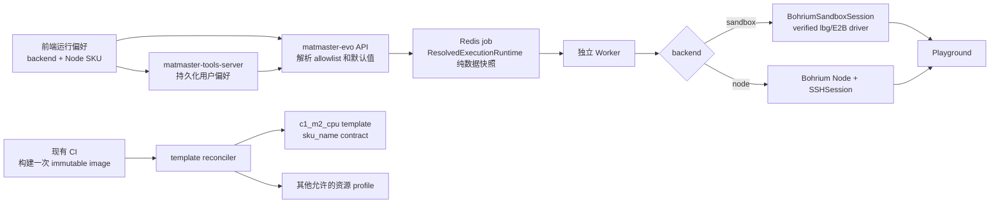

# Sandbox / Node 可选运行环境实施计划

> **执行说明：** 本计划跨越 `matmaster-evo`、`matmaster-tools-server`、
> `scimaster-bohr-chat` 三个仓库。先完成 Gate 0 的运行契约验证，再按阶段实现；
> 不允许把待验证的 Launching、`lbg sdbx` 或 E2B 兼容层行为直接当成生产契约。
> 2026-07-13 已通过 `lark-cli` 读取《Bohr_sandbox技术设计》的完整 Wiki 子树：
> 7 个直接子节点及其 7 个后代节点（共 14 个子文档），并下钻读取其中嵌入的 SKU、
> 竞品、存储、计费电子表格和多维表格。根文档与《bohr_sandbox接口》停留在 2026-03；
> 子树中同时存在 2026-04 的计费设计、2026-06 的问题收集和 2026-07-02 的
> 《Bohr-sandbox 接入文档》。因此不能把整棵飞书文档一概视为旧版，也不能按目录顺序
> 推定新旧；每条结论仍需与当前 Launching、Shrimp、Open Platform 和
> `lbg 4.0.0b56` 逐项复核。生产部署 revision 由 test contract smoke 最终确认。

**目标：** 用户可在预制 Sandbox 与 Bohrium Node 之间选择执行环境；用户没有保存偏好时
固定使用 `sandbox-c1-m2 -> c1_m2_cpu`，第一版不提供 Sandbox 机型选择；
镜像由现有 CI 构建一次，再同步到各资源 profile 对应的稳定 template；Node 在收费后
具备明确且可执行的回收策略。

**架构原则：** API 只解析、校验并入队可序列化的运行环境快照，Worker 才创建
Sandbox SDK 对象或 Node/SSH session。用户偏好由 `matmaster-tools-server` 持久化，
`matmaster-evo` 持有可用运行环境目录和实际运行逻辑；第一版前端只提交 backend 和已有
Node SKU，不提交 Sandbox profile、SKU 或任意 `sandbox_template_name`。

**涉及仓库：**

- `matmaster-evo`：运行环境目录、CI/template 发布、Sandbox session adapter、
  API/Worker 路由、Node 回收、观测与集成测试。
- `matmaster-tools-server`：用户运行环境偏好、数据库迁移与聚合偏好接口。
- `scimaster-bohr-chat`：Sandbox/Node 选择、固定 Sandbox 规格展示、Node 机型选择、费用和
  生命周期提示、每轮请求快照。
- `launching`：本阶段原则上不改；仅作为模板和 Sandbox OpenAPI 的契约来源。
- `open-platform`：外部 `/openapi/launching/v2/bohr_sandbox/*` 路由与灰度目标的契约来源。
- `shrimp`：E2B SDK、会话 workspace 和生命周期策略的已上线调用样例，不直接复制其
  TypeScript 实现或策略默认值。
- 飞书《Bohr_sandbox技术设计》完整子树：2026-07《接入文档》和 2026-06《问题收集》
  作为当前使用/风险线索；2026-03/04 的接口、计费设计和 Todo 作为历史背景。所有字段、
  状态和配置仍以当前代码或 live API 复核。

### 资料新旧顺序（截至 2026-07-13）

1. 当前运行代码优先：Launching `1d8f19b`（2026-07-10）、Shrimp `c182b42`
   （2026-07-13）以及 Open Platform `origin/master` `e4fa526`（2026-07-11）。
2. 当前客户端契约其次：PyPI `lbg 4.0.0b56`（2026-07-10）；稳定版 `1.2.29` 不含
   本计划需要的 `lbgcore.sdbx`，不能误装。
3. Bohrium Sandbox GitHub skill（最近相关提交为 2026-06）可用于用户侧限制说明，
   但 SDK/字段/存储语义以当前代码和 `lbg` 为准。
4. 飞书子树按节点更新时间和内容逐篇使用：2026-07《接入文档》确认 lbg/E2B 两种接入、
   `e2b<=2.20.0`、默认 12h 和镜像缓存等待；2026-06《问题收集》提供磁盘、二进制传输、
   pause 和冷镜像风险；2026-03/04 的旧接口/计费字段与现行代码冲突时标记“已过时”，
   不设计双协议兼容。

---

## 1. 已确认的方案

### 1.1 用户选择模型

1. 一级选择是执行后端：`sandbox` 或 `node`。
2. 二级选择由后端决定：
   - `sandbox`：第一版固定使用 MatMaster 内部 profile `sandbox-c1-m2`，不提供机型选择；
   - `node`：继续选现有 Bohrium Node SKU。
3. 固定默认值为 `sandbox-c1-m2`，映射到 `c1_m2_cpu` 的预制 template；
   profile id 不编码 provider SKU 的 `_cpu` 后缀或
   “免费”，避免平台以后调整价格时语义失真。
4. 前端和用户偏好只保存 `execution_backend`；Sandbox profile id 只存在于 evo 内部 catalog
   与 resolved job snapshot，用于 template/SKU 映射、日志和校验，不进入用户偏好或请求。
5. 用户在运行中修改偏好，只影响下一次入队；已入队和正在执行的 run 使用入队时
   已解析的快照。
6. 不区分新老用户、不做数据库批量迁移：只要请求和数据库都没有显式偏好，就解析为
   `sandbox-c1-m2`。明确保存过 `node` 的用户保持 Node；未来真正开放多个 Sandbox profile
   时再增加独立的用户选择字段和迁移。
7. `c1_m2_cpu` 只有在 live SKU 目录仍存在且平台确认属于当前免费 SKU 时才允许创建；缺失、
   转为收费或免费状态无法在允许的缓存时效内确认时，返回明确的 Sandbox unavailable 错误，
   UI 提示用户自行选择 Node。任何入口都不得静默切换到可能收费的 Node。

### 1.2 镜像与 template

1. 继续复用 `matmaster-evo` 当前 CI 的 `Dockerfile.remote` 镜像构建，镜像只构建一次。
2. 不再对同一 Dockerfile 调用 Launching `/image/build` 做第二次构建。
3. 一个 Sandbox template 固定绑定：一个镜像、一组资源规格和一组启动配置；当前创建
   契约用 `sku_name`，Launching 再从 goods `bohr_sandbox` scene 和动态
   `service_specs` 解析 CPU、内存与 GPU。飞书旧 curl 中直接传 `cpu/memory` 的写法已过时。
4. 多个 Sandbox 资源 profile 可以共用同一镜像，但每个 profile 有独立 template。
5. template 在 CI/发布阶段预先创建或更新，不让第一个用户承担 template build/create。
6. template name 是稳定槽位，例如 `matmaster-c1-m2`；镜像使用不可变版本引用。
7. template name 本身不能说明镜像是否变化。CI 通过 lookup 返回的
   `data.image` 与本次构建产出的完整 OCI image ref/digest 比较：
   - template 不存在：`POST`，同时设置经 G0.2 验证的 resource spec 和 `image`；
   - template 存在且 resource spec 一致、image 不同：`PATCH` image；
   - template 存在且 image 相同：no-op；
   - template 存在但 resource spec 不一致：失败，不能用 PATCH 偷换资源规格。
8. 旧镜像不能在新镜像 ready 前删除；保留至少一个可回滚版本，延迟清理。
9. `lbg 4.0.0b56` 还支持在创建 Sandbox 时传
   `e2b.agents.kruise.io/image=<image-path>`，即“template 必填，但本实例覆盖 image”。
   这不是 image-only create：SKU/CPU/内存/GPU 仍来自 template。MatMaster 正常发布仍采用
   CI 更新 template image，以复用预热缓存；实例级 image override 只用于受控 smoke/canary，
   不暴露给前端。
10. template `PATCH` 不携带 SKU 是预期行为：当前 `lbg` 只发送 `{"image": ...}`，
    后端保留原 template 的资源规格。资源规格只在 template `POST` 时确定。
11. template `POST` 当前最小资源契约已从源码与 `lbg` 双重确认：
    `name/image/sku_name`。Launching 在 `sku_name` 缺失时明确返回 400；`PATCH` 只允许
    更新 `image`。Gate 0 只验证部署环境确实运行这版契约、账号权限和错误语义，不再把
    旧 `cpu/memory` payload 作为 fallback。
12. 创建/修改 template 后，当前 Launching 会异步执行 image cache ensure，并维护
    creating/ready/failed 状态；飞书中的“镜像缓存同步 Todo”已过时。CI 仍必须等 template
    与实际 Sandbox smoke ready，不能把异步提交成功当成镜像已经可用。
13. 2026-07《接入文档》列出的 `lbg sdbx image build/commit` 是可选制镜像能力，不是
    template 创建前置步骤。MatMaster CI 已产出可拉取的 registry image ref 时，直接把该
    image 写进 template，不再调用 image build/commit。
14. 2026-06《问题收集》记录“同镜像换 template name 仍重新建缓存”；这进一步支持使用
    稳定 template name + image-only PATCH，而不是每个镜像版本创建一个新 template name。

### 1.3 Sandbox 生命周期边界

1. 普通 `/workspace` 属于 Sandbox 临时盘，kill 后不能读取；它只能用于可丢弃的临时文件。
2. Sandbox 创建时默认发送 `bohr.launching.io/mount-user-storage=true`，挂载当前用户的
   `/personal` 和当前项目的 `/share`；运行 job 必须携带有效 user/project 身份，不能借用 CI
   template 账号的盘。
3. Sandbox 与 Node 复用现有 `SessionDirectoryResolver`：本轮显式目录优先，其次会话已绑定
   目录，均未设置时默认 `/share`；只允许 `/share`、`/personal` 及其子目录。不再把
   `/bohr-workspace` 作为 MatMaster 工作区契约。
4. 第一版采用 lazy allocation + run-owned Sandbox：第一次远端操作才创建，run 正常完成、
   失败或取消后 kill；下一轮新实例重新挂载同一 `/personal`、`/share` NAS，继续使用会话
   绑定目录中的文件。
5. Sandbox hard TTL 固定为 2 小时（`7200` 秒）兜底 Worker 崩溃；正常、失败或取消仍在
   run finally 立即 kill，不等待 TTL。不使用 `timeout=0` 或 `never-timeout`。第一版不支持
   Sandbox 内后台进程跨 agent run 继续运行；需要长任务时使用 Bohrium Job 或明确选择 Node。
6. Launching 当前 user-storage 获取失败会只记 warning 并继续创建 Sandbox，因此 adapter
   必须在 open 后检查 `/personal`、`/share` 确实是预期挂载且可读写；缺少任一必需挂载时
   fail closed，不能在容器临时根目录里创建同名目录后继续运行。
7. 第一阶段只启用已验证存储行为的 CPU profile；GPU profile延后。
8. `/personal/.matmaster/skills`、`/personal/.matmaster/plugins` 和
   `/personal/.matmaster/AGENT.md` 等现有用户资产在 Sandbox 中沿用同一路径，不另做
   `/bohr-workspace` 数据同步。
9. Shrimp 当前支持 0、15 分钟、30 分钟、2 小时、6 小时、24 小时等有限释放延迟，并以
   7 天 hard TTL 兜底；它证明“有限时长 + DB/cron 回收”可行，但 MatMaster 第一版仍采用
   更简单的 run-owned close，不能照搬 Shrimp 的 `never-timeout` metadata。

### 1.4 Node 生命周期

1. 保留“同一 user/org/project/SKU 一个 Node 槽位”的复用模型；同一槽位并发 invocation
   共享同一 Node 并分别建立 SSH session，不各自创建 Node；不同用户、项目或 SKU 才使用
   不同槽位。
2. 每个 invocation 建立独立的共享 lease，记录 `invocation_id/session_id/lease_token` 和 TTL；
   `worker_id` 只用于日志和现有 Redis worker-alive 观测，不持久化为 lease owner。多个有效
   lease 可以同时执行。目录继续按会话选择 `/personal/...` 或 `/share/...`，产品接受少量全局
   进程/环境修改可能相互影响的风险，不增加强制串行队列。
3. Redis 分布式锁只保护槽位 create/replace/last-release 等短临界区，不覆盖整轮执行。第一个
   invocation 先原子占 `creating` 槽位再创建 Node；其他 invocation 等槽位 ready 后共享，不能
   因创建竞态再开一台。
4. 第一版 lifecycle 仍为 `run_end`：每个 invocation finally 只释放自己的 lease；还有其他
   live lease 时 Node 保持运行，最后一个 lease 释放后调用 Bohrium stop 进入 `Paused`，不 delete
   节点。新 acquire 与最后释放在同一槽位锁/CAS 下判定，避免“刚复用就被另一 Worker 停掉”的
   竞态。Paused 节点不计运行费用、保留磁盘和 `node_id`，下一次 invocation 走 restart 复用；
   该计费与数据保留语义仍须以 live 环境对账为发布条件。
5. 内部从第一版就使用 typed lifecycle policy，而不是在 Worker 中散落 `if run_end`：当前
   `enabled_policies` 只有 `run_end`；resolved job snapshot 显式携带 policy 和 nullable
   `idle_timeout_seconds`，因此队列中的旧任务行为不会随配置变化。
6. 为以后“最后一个 invocation 结束后保留，空闲 N 分钟自动关闭”预留 `idle_timeout` policy；
   时长必须来自服务端有限 allowlist，并有绝对 hard cap，不支持真正的 forever。第一版
   allowlist 为空，前端不显示时长选择器，客户端提交 `idle_timeout` 返回 4xx。
7. 用户偏好表和 Node 槽位表预留 lifecycle/idle timeout 字段；第一版 NULL 统一解析为
   `run_end`，不会改变现有用户行为。
8. Bohrium 的 `turnoffAfter` 是从创建、重启或修改时刻起算的定时关机，不是根据 SSH、文件或
   CPU 活跃度计算的真正 idle detector；当前 MatMaster 默认 `-1` 实际上禁用了它。因此它只作为
   Node stop 的 provider 执行能力和失联兜底，不能代替 invocation lease/refcount。
9. Worker 异常退出后 recycler 只清理该 invocation 的过期 lease；仍有其他 live lease 时不得
   停止 Node。所有 lease 都消失后按当前 lifecycle 立即 stop 或进入 idle。
10. 将来启用 `idle_timeout` 时优先复用 Bohrium 原生定时关机：active lease 归零后在槽位锁内
    写入 `idle_expires_at` 并设置 provider `turnoffAfter`；新 invocation 在到期前原子取消 deadline
    并把自动关机改回 `-1`，已 Paused 则 restart。数据库 desired state 和 recycler 负责对账、
    重试与竞态处理，provider 负责实际定时停止，不能维护两套互不校验的 idle 时钟。
11. delete 不属于普通 `run_end`：只用于镜像过期、节点不可恢复、用户显式删除，或平台确认
    Paused 仍产生存储费用后增加的有界保留期清理；任何时候都不能因一个 invocation 结束而
    delete 其他 invocation 正在共享的节点。

### 1.5 API / Worker 边界

1. API 从请求或用户偏好解析运行环境，并在入队前做 allowlist 校验。
2. Redis job 只携带 Pydantic/dataclass 可解析的纯数据快照。
3. `lbg`/E2B client、Sandbox 对象、SSH session、factory、callback 不进入 Redis job、
   `run_meta` 或 `RuntimePorts`。
4. Worker 根据快照创建具体 session，再通过现有 `Playground` session 边界注入。
5. Bohrium 凭证/作业提交能力与“本轮在哪个执行环境运行”必须拆开；选择 Sandbox
   不等于禁用 Bohrium 作业提交，选择 Node 也不应成为读取用户偏好的前提。

---

## 2. 尚未确定的事项与 Gate 0

以下事项不能靠代码猜测。Gate 0 未全部通过前，可以写单元测试和接口骨架，但不能在
生产环境发布带 Sandbox 默认值的新版本。

| Gate | 待确认事项 | 推荐结论 | 验证方式 / 产物 |
|---|---|---|---|
| G0.SEC（立即处理） | 飞书技术设计及相关仓库说明中出现疑似真实 kubeconfig、私钥或云服务 AccessKey/Secret；无论当前是否仍有效，都不能作为文档示例保存 | 由安全/平台 owner 立即轮换或吊销相关凭证，删除或脱敏正文/仓库内容并审计访问记录；MatMaster 不复制、记录或尝试使用这些值 | 轮换工单 + 文档与仓库脱敏复核 + 凭证使用审计；完成前禁止把已暴露凭证用于 PoC |
| G0.1（部分确认） | `/image/private` 列表响应已确认 `data.items[].url` 是完整 registry image ref；仍需确认 Sandbox 集群能用现有 imagePullSecret 拉取该地址 | CI 在 `status=2` 后记录对应 item 的 `url`，不能继续只记录数字 image id 和 `matmaster:<tag>` | 已有样例：`registry.dp.tech/dptech/dp/native/prod-11909/matmaster:<version>`；剩余验证是用该 URL 创建 template 并成功拉起 Sandbox |
| G0.2（代码契约确认、部署待验） | 当前 Launching 与 `lbg 4.0.0b56` 一致要求 template create 使用 `name/image/sku_name`，SKU 决定实际资源；仍需确认 test 部署 revision、CI 服务账号 owner/admin 权限及真实 400/403/404/409 响应 | 按当前契约做 disposable template smoke；若 live 服务与代码不一致则阻断发布并升级服务或明确版本，不回退到飞书旧 `cpu/memory` payload | 用 test AK 和唯一临时名称完成 paged list/lookup → create → image-only update → lookup → create sandbox → delete；保存脱敏 fixture 和响应 build/version |
| G0.3（客户端已选） | `lbgcore.sdbx` 明确导出公共 facade；create/template 由 `SdbxOpenApiClient` 处理，exec/files/connect/kill 由 `SdbxE2BClient` 包装 `e2b==2.20.0` | 第一版 pin `lbg==4.0.0b56`，在 MatMaster 窄 driver 后直接 import，不走 CLI subprocess、不自行重写 HTTP；beta 升级必须重新跑 contract tests | PoC 直接调用两类 client 完成 create、exec、files、describe、kill、timeout、鉴权和错误映射；验证进程环境隔离 |
| G0.4（路径策略已确定，待实测） | 当前 Launching 的 user-storage 默认关闭；设置 `bohr.launching.io/mount-user-storage=true` 后从 Bohrium Core/Storage Manager 追加 personal 和 project share CSI，但 user/project/存储解析失败时只 warning 并继续，且没有有效 projectID 时不会挂 share | MatMaster Sandbox 默认要求 `/personal` 和 `/share`；复用现有目录选择语义，默认 workdir `/share`，允许会话绑定到两者任一子目录；创建后严格验证挂载，不使用 `/bohr-workspace` | Sandbox A 分别在 `/personal`、`/share` 写文件 → kill → Sandbox B 读取；验证不同 user 的 personal 隔离、不同 project 的 share 隔离、读写权限、缺失 projectID/挂载时 fail closed，以及 Node/Sandbox 对同一路径看到相同文件 |
| G0.6（选择与访问策略已确定） | 默认 SKU 的实时可用性/价格、免费白名单、并发上限、template owner、预热 replicas | 第一阶段固定开放并默认使用 `c1_m2_cpu`；live `/skus` 用于确认它当前存在且免费，不动态替换成其他 SKU。缺失、转为收费或无法及时确认免费状态时 fail closed，不自动选择 Node。template 由 CI 服务账号创建并固定 `visibility=public`，普通用户可 lookup/create，但只有 owner/admin 可更新或删除 | 调用当前 `/bohr_sandbox/skus` 并由平台核对 `FreeSkuNames`、免费额度、`max_running_bohr_sandbox_per_user` 和预热成本；`c1_m2_cpu` 不存在或不免费时阻断发布/新建实例。分别用 owner 与普通最终用户 AK 验证 lookup/create/update/delete 权限，不能把文档价格写成长期产品契约 |
| G0.8（方案已收敛） | 实例创建与销毁粒度 | 第一版 lazy allocation + run-owned close；跨轮文件放 `/personal` 或 `/share`，不支持 Sandbox 后台进程跨 run | 验证首条命令延迟、run finally kill、Worker 崩溃 TTL 和 NAS 跨轮文件行为 |
| G0.9（能力差异） | GitHub skill 称 Sandbox 为 user-mode、运行期不能 `apt install`，但 2026-04 能力分享又示例了 `user="root"` 与 `playwright install --with-deps`；默认海外出站代理和现有 MatMaster skills 兼容性也未确认 | 不从相互冲突的文档承诺 root；必要系统包装入预制镜像，明确代理和网络策略；需要 root/长期开发机的工作流引导用户选择 Node | 扫描 skills/工具命令，并在最终 MatMaster template 中实测 root/user、apt、pip、git、国内/海外网络和常见系统依赖 |
| G0.10（部署与灰度契约） | 旧设计稿中的文件 API、image cache、状态管理和 OpenAPI Todo 已在当前 Launching/lbg/Shrimp 代码中有实现；但 Open Platform 当前可按用户/比例/调试头把同一路径灰度到 Launching 或独立 `bohrsandbox` 服务，且 orphan cleanup 的真实删除开关默认可能仍关闭 | 把外部 OpenAPI 路径视为稳定入口，但不能假定唯一后端；对可命中的两个目标做相同 contract smoke，并由平台确认生产 `orphan_cleanup_enabled`、idle release 与网关超时配置 | 对两个灰度 cohort 测试 template、create、commands、PTY、文本/二进制文件、静默长命令、kill/TTL/orphan；记录两端版本和能力差异，差异未收敛前不发布新版本 |
| G0.11（身份策略已确定、计费待验） | template 由 CI 服务账号维护；Sandbox 实例的 owner、org/project、AK 和挂载身份必须与当前用户运行上下文一致 | CI 凭证只管理 template；运行实例固定使用当前用户的 Bohrium 身份和当前 project scope，才能挂载该用户 `/personal` 与项目 `/share`。AK 只在 Worker 解析，不进入 Redis；缺少运行凭证或 project 时明确报错，不借用服务账号或切换 backend | 以当前用户/项目创建和关闭 Sandbox，对账 owner、org/project、0 元 SKU trade/账单和两块 NAS 权限；验证普通用户能使用预制 template 且无法修改它 |
| G0.12（磁盘、pause、二进制） | 2026-06《问题收集》记录默认 overlay 30GB、默认 text 下载会破坏二进制、GPU pause 行为不透明；当前 Launching 已增加 `extra_ephemeral_storage_gb` 和 `pause_enabled`，但 live 行为未验 | profile/catalog 显示实际临时盘容量；第一版 public template 的 `extra_ephemeral_storage_gb` 固定为 0（当前服务只允许 private template 扩盘）；CPU template 显式 `pause_enabled=false`；driver 对二进制统一走 bytes | 用大文件验证 30Gi base、冷镜像和 cache；传输 `.pt/.tar/.gz` 后校验 hash；运行长命令验证 pause/resume/never-timeout 组合和实际 metadata；如需扩盘，先推动平台放开 public template 扩盘能力 |
| G0.13（Node 原生停止能力） | 当前 Bohrium Core/bohrctl 表明 `turnoffAfter` 按创建、重启或修改后的固定时长关机，Paused 状态可 restart、数据保留且标称不计费；当前 MatMaster 已支持 restart，但默认 `turnoffAfter=-1` 且只有 delete adapter | 第一版 `run_end` 在最后一个 live lease 结束后 stop 为 Paused，不 delete；未来 `idle_timeout` 复用 provider 定时关机，lease 和 DB desired state 仍是并发与对账真相源 | 在 test 对同一 Node 完成 create → 写盘 → stop/自动关机 → 确认账单停止 → restart → 校验数据；验证当前可用 stop/modify OpenAPI 版本、`turnoffAfter` 单位/精度/重置语义、长任务不会误停，以及 Paused 是否另收磁盘费用 |

2026-07-13 test live preflight/首次 smoke 结果（脱敏证据见
`docs/integrations/launching-sandbox-contract.md`）：

- `c1_m2_cpu` 当前返回 SKU ID 456、1C2G、`0.00 RMB/h`，但仍未取得部署侧
  `FreeSkuNames` 与 trade 对账证据；G0.6 仅部分通过。
- test 当前 MatMaster image ID 49106 为 Ready，完整 registry URL 已解析。首次 disposable
  template 创建因 owner 配额 `1/1` 被 400 拒绝；确认原 owner template `cpu-test` 无可见
  Sandbox 后，已按明确授权删除并创建稳定 Public `matmaster-test-c1-m2`，绑定
  `c1_m2_cpu`、该 MatMaster image、`replicas=0`。精确 lookup 已验证 owner、Public、active、
  SKU、image 与 warmup pool；当前响应未回传 `pause_enabled` 和 `image_cache_status`，需在
  Sandbox 成功启动后继续验证。
- 当前用户可 lookup 并提交创建其他 owner 的 Public `doc-compiler`（`c1_m2_cpu`），Public
  访问语义通过；创建随后因 CSI mount `deadline_exceeded` 返回 500，未获得 sandbox ID，按唯一
  run ID 对账未发现可见残留。因此 G0.4 的 `/personal`、`/share` 挂载/持久化仍阻塞发布。
- test 客户端入口固定为 `https://openapi.test.dp.tech`；PoC 已改为按 test/uat/prod 解析 host，
  并支持从 gitignored `.env.test` 安全加载现有 Bohrium 身份变量。

另外还有两个非阻断但必须在上线前给出明确配置的项目：

- 如果 test/uat/prod 共享 template namespace，template name 必须带环境后缀；若各环境
  完全隔离，可以保持 `matmaster-c1-m2`。不要把这个判断散落在 shell 中。
- GPU Sandbox 的 user-storage、权限和运行时兼容性尚未验证；第一阶段不把 GPU 放进 profile
  allowlist，等单独验证后再开放。

---

## 3. 目标数据流



关键不变量：

- 第一版用户只选择 backend；evo 内部使用 `profile_id`，运维管理 `template_name`，平台调度
  `sku_name`。Launching 解析出的 CPU/内存/GPU 是校验和展示事实，不是 MatMaster 另行提交的
  第二套资源字段。
- API 入队后，即使用户立即修改偏好，该 run 的 backend/template/resource spec 也不变化。
- Worker 可以横向扩容，不能依赖处理 HTTP 请求的 API 进程里存在 SDK 对象。
- 更新稳定 template 的 image 只影响后续新建实例，不要求在线实例热切换。

---

## 4. 配置和协议契约

### 4.1 运行环境目录

在 `matmaster-evo` 新增版本化配置，例如
`config/execution_runtime_profiles.yaml`：

```yaml
version: 1
default_backend: sandbox
node_lifecycle:
  default_policy: run_end
  enabled_policies:
    - run_end
  idle_timeout_options_seconds: []
sandbox_storage:
  mount_user_storage: true
  required_mounts:
    - /personal
    - /share
  allowed_workspace_roots:
    - /personal
    - /share
  default_workspace_path: /share
sandbox_profiles:
  - id: sandbox-c1-m2
    label: Sandbox 1C2G
    sku_name: c1_m2_cpu
    template_visibility: public
    template_name_by_env:
      test: matmaster-test-c1-m2
      uat: matmaster-uat-c1-m2
      prod: matmaster-c1-m2
    enabled: true
    is_default: true
    hard_timeout_seconds: 7200
    extra_ephemeral_storage_gb: 0
    pause_enabled: false
  - id: sandbox-standard
    label: Standard Sandbox
    sku_name: c2_m4_cpu
    template_visibility: public
    template_name_by_env:
      test: matmaster-test-c2-m4
      uat: matmaster-uat-c2-m4
      prod: matmaster-c2-m4
    enabled: false
    is_default: false
    hard_timeout_seconds: 7200
    extra_ephemeral_storage_gb: 0
    pause_enabled: false
```

要求：

- 启动时做严格 schema 校验：profile id 唯一、template name 唯一、恰好一个默认 profile、
  timeout/额外磁盘有上下界、当前环境必须有 template name。
- `node_lifecycle.default_policy` 必须包含在 `enabled_policies` 中；第一版只允许 `run_end` 且
  `idle_timeout_options_seconds` 必须为空。后续启用 idle timeout 时，选项必须去重、递增、
  大于 0 且不超过届时明确的 provider hard cap。
- `sku_name` 和 `template_name` 只由服务端目录产生。当前 provider contract 已固定为
  `sku_name`；test 部署若不支持则阻断启用，不能在同一 payload 混发或回退
  `cpu/memory`。
- image ref 不写入该运行时目录；它由本次 CI 构建产物传给 template reconciler。
- template visibility 固定为 public；额外临时盘与预热/pause 发布策略必须进入版本化
  CI 配置，不能依赖接口默认值或散落在 shell 常量中。启动校验 public template 的
  `extra_ephemeral_storage_gb` 必须为 0；前端只接收磁盘容量和 pause 行为说明。
- `sandbox_storage` 第一版固定要求 user storage、`/personal` 和 `/share`；默认 workdir `/share`
  与现有 Node 一致。实际本轮目录仍由已有 request/session directory 解析，必须落在
  `allowed_workspace_roots` 下，不能由前端传任意容器路径。
- Worker create 时发送 `bohr.launching.io/mount-user-storage=true` 和 job 中已有的当前
  user/project 身份；CI template owner 身份只用于 template reconcile，不能用于运行实例挂盘。
- 是否免费和实时价格不写死在 profile label/config 中；由当前 `/bohr_sandbox/skus`
  响应与平台 `FreeSkuNames` 配置确认。UI 不能仅凭 profile id 宣称免费；超过允许缓存时效
  仍无法确认，或 `c1_m2_cpu` 已不免费时，catalog 标记 unavailable 且 create fail closed。
- 实例级 image override 不属于用户 profile/request contract，仅允许 CI smoke 或受控 canary。
- 对前端暴露的 catalog 不返回内部鉴权信息、image registry 凭证或用户不可选的 profile。

默认值直接来自上述版本化 catalog：`default_backend: sandbox` 加唯一的
`is_default: true` profile。第一版不再增加默认 backend feature flag、用户/组织灰度名单或
新老用户分支。已入 Redis 的 job 始终使用入队快照，不因后续偏好变化而切换 backend。

### 4.2 用户偏好

`matmaster-tools-server.user_preference` 新增：

| 字段 | 类型 | 语义 |
|---|---|---|
| `execution_backend` | nullable varchar | `sandbox` / `node`；NULL 固定表示使用 `sandbox-c1-m2` |
| `bohrium_node_lifecycle_policy` | nullable varchar | 预留 `run_end` / `idle_timeout`；第一版 NULL 或 `run_end` 均解析为 `run_end`，其他值拒绝 |
| `bohrium_node_idle_timeout_seconds` | nullable int | 仅未来启用 `idle_timeout` 时有效，必须来自服务端有限 allowlist；第一版必须为 NULL |

保留现有 `bohrium_node_sku_id` 和 `bohrium_job_max_runtime_seconds`。后者是提交作业的
最长运行时间，不能复用为 Node idle timeout、Node hard cap 或 Sandbox hard TTL。

### 4.3 前端请求

`POST /chat/.../stream` 的请求新增可选字段：

```json
{
  "execution_backend": "sandbox",
  "bohrium_node_sku_id": null,
  "bohrium_node_lifecycle_policy": null,
  "bohrium_node_idle_timeout_seconds": null
}
```

兼容规则：

1. 请求显式值优先，其次用户偏好；两者都未设置时固定使用 `sandbox-c1-m2`。
2. `sandbox` 时忽略 Node SKU并由服务端固定选择内部 `sandbox-c1-m2`；`node` 时固定使用
   catalog 当前唯一启用的 `run_end`。
3. 第一版请求不接受 Sandbox profile/SKU/template override；客户端伪造这些字段时返回 4xx。
   内部默认 profile 不存在、被禁用或不属于当前环境时 fail closed。
4. Node lifecycle 字段为协议预留：第一版只接受 NULL/`run_end` + NULL timeout；
   `idle_timeout` 或任意非空秒数返回 4xx。老前端不传字段时解析为 `run_end`。

### 4.4 Redis job 快照

API 解析后写入明确的 `ResolvedExecutionRuntime`，示例：

```json
{
  "backend": "sandbox",
  "catalog_version": 1,
  "sandbox": {
    "profile_id": "sandbox-c1-m2",
    "template_name": "matmaster-c1-m2",
    "sku_name": "c1_m2_cpu",
    "hard_timeout_seconds": 7200,
    "workspace_path": "/share",
    "mount_user_storage": true,
    "required_mounts": ["/personal", "/share"]
  },
  "node": null
}
```

Node 分支的内部 snapshot 固定显式化生命周期，例如：

```json
{
  "backend": "node",
  "node": {
    "sku_id": 388,
    "lifecycle_policy": "run_end",
    "idle_timeout_seconds": null
  },
  "sandbox": null
}
```

Worker 必须用 `extra="forbid"` 的 typed model 解析。该对象属于队列协议，不写入
`run_meta`；Sandbox session 等运行能力仍通过 `Playground` 的显式 session/runtime
边界传递。运行实例计费需要的 user/org/project 只复用 job 顶层已有的可序列化身份事实；
AccessKey 在 Worker 内按现有凭证边界解析，不能塞入该 snapshot 或 `run_meta`。

### 4.5 数据库与 Nacos 影响

数据库需要两处迁移：

1. `matmaster-tools-server.user_preference` 新增 nullable 的 `execution_backend`，并为 Node
   后续能力预留 nullable 的 `bohrium_node_lifecycle_policy`、
   `bohrium_node_idle_timeout_seconds`。旧行不回填：backend 为 NULL 时默认 Sandbox，Node
   lifecycle 为 NULL 时默认 `run_end`。第一版不增加 `sandbox_profile_id`，也不接受非空 idle
   timeout。
2. `matmaster-evo.evo_bohrium_nodes` 保留 `uk_user_org_project_sku` 唯一复用槽位，并增加
   nullable `node_id` 的唯一索引、`state`、`creating_invocation_id`、
   `creating_lease_token`、`creating_lease_expires_at`，以及 `lifecycle_policy`、`idle_timeout_seconds`、
   `idle_expires_at` 等 lifecycle 字段和到期扫描索引。第一版 `run_end` 会使用 `paused` 状态，
   `idle_expires_at` 仍为空；另建
   `evo_bohrium_node_leases`，按 invocation 记录 `node_slot_id/session_id/invocation_id/lease_token/
   lease_expires_at`，允许同一槽位存在多个 live lease。所有 create/replace/last-release/stop/delete
   在槽位 Redis 分布式锁下配合数据库 CAS；禁止当前 `ON DUPLICATE KEY UPDATE node_id` 覆盖
   ready 节点。创建前先以 `state=creating,node_id=NULL` 占槽，避免两个 Worker 同时调 provider
   create；旧记录先 dry-run 对账实际节点再迁移。

这里使用现有 `invocation_id` 表示一次顶层调用的共享 lease，不新增 `run_id`，也不把事件/任务
分组用的 `task_id` 当成 Node 租约主标识；数据库/Redis 只保存标识、状态和 TTL，不保存
SSH/session/service 对象。`lease_token` 是每次 claim 生成的随机 fencing token；heartbeat、release
和创建结果落库都必须同时匹配 invocation + token，防止旧 Worker 的迟到操作覆盖新接管者。

Sandbox 第一版不新增实例表：正常路径显式 kill，Worker 崩溃由 2 小时 provider TTL 和
Launching orphan cleanup 兜底；如果 live 验证证明无法按 metadata 对账孤儿实例，再单独增加
统一 resource lease 表，不能预先把 SDK/session 对象持久化。

MatMaster 不新增 Nacos key：默认 backend/profile、2 小时 TTL、Public template 映射和
`/personal`/`/share` 挂载策略都放在版本化 runtime catalog/CI 配置中，用户选择放数据库，
不做 Nacos 灰度或动态默认值。

Launching 侧只核对现有动态配置：`free_sku_names` 包含 `c1_m2_cpu`、
`max_running_bohr_sandbox_per_user` 符合容量、`user_storage` 能返回 rw personal/share、
`orphan_cleanup_enabled` 已真删而非 dry-run，并记录实际 `idle_release_seconds`。若生产值已满足
则无需改 Nacos；不满足时由 Launching owner 修改其 Nacos 后再发布 MatMaster。

---

## 5. 分阶段实施任务

## Task 0：完成 `lbgcore.sdbx` / Launching 契约 PoC

**仓库：** `matmaster-evo`

**Files:**

- Create: `scripts/poc_launching_sandbox.py`
- Create: `docs/integrations/launching-sandbox-contract.md`
- Create: `tests/scripts/test_poc_launching_sandbox.py`

- [x] 通过 `lark-cli` 读取《Bohr_sandbox技术设计》（revision 1369）及关联的
  《bohr_sandbox接口》（revision 150），确认控制面/数据面分层、E2B 兼容目标、
  template create 路径、`X-API-KEY` 鉴权和旧版 `cpu/memory` 请求字段；该资源字段示例
  已标为历史资料。
- [x] 递归枚举并读取完整 Wiki 子树：7 个直接子节点、7 个更深层节点，以及其中嵌入的
  SKU/竞品/计费 Sheets 和打镜像排期 Base。确认《接入文档》更新于 2026-07-02、
  《问题收集》更新于 2026-06-15，不能跟根文档一起按 2026-03 版本处理；空白的
  《使用示例》《迭代》《todo》和模板化《sdbx打镜像技术设计》不提供有效契约。
- [x] 从子文档确认官方同时支持 `lbg` CLI 和 E2B Python/TS SDK，Python E2B 兼容上限为
  2.20.0；SKU 表当前记录 `c1_m2_cpu=0元/h`、`c2_m4_cpu=0.36元/h`，但价格和精确
  SKU 名仍必须由 live `/skus` 与 `FreeSkuNames` 复核。
- [x] 对照 `lbg 4.0.0b56` wheel 源码，确认它对同一 template create 路径要求
  `name/image/sku_name`，template update 只发 `image`，因此已有飞书 curl 中没有 SKU
  不能说明 template 没有资源规格。
- [x] 对照当前 Launching，确认 `sku_name` 必填并由服务端解析实际资源，template PATCH
  是 image-only，create/update 会异步维护 image cache；旧飞书 Todo 和 `cpu/memory`
  curl 不再作为待选契约。
- [x] 对照当前 Shrimp，确认它运行时直接使用 E2B SDK（不是手写 HTTP），已使用
  session workspace、二进制 files API 和 DB-backed 生命周期；这些是行为参考，Python
  实现仍以 `lbg` contract smoke 为准。
- [x] 对照 Open Platform `origin/master`，确认外部 bohr_sandbox 路径可能灰度到
  Launching 或独立 `bohrsandbox` 服务；不能只验证一个内部域名。
- [x] 根据 `/image/private` 列表响应确认完整 registry image ref 字段为
  `data.items[].url`；现有 MatMaster ready 记录已返回完整 `registry.dp.tech/.../matmaster:<version>`。
- [ ] 先完成 G0.SEC：轮换/吊销飞书或仓库文档中疑似泄露的凭证并脱敏；PoC 只使用单独的
  test service account，不复制旧文档里的配置。
- [ ] 向平台 owner 确认 test/uat/prod 部署 revision 与 Open Platform 灰度配置；外部
  endpoint 必须接受当前 `name/image/sku_name` contract。若不一致，升级/修复平台后再测，
  禁止回退到 `cpu/memory` 猜协议。
- [ ] 使用 test 环境服务账号把该 `url` 写入 template，确认 Sandbox 集群具备对应
  registry pull 权限；字段存在不等于集群一定能拉取。
- [ ] 用唯一、可清理的 test template 验证 paged list/精确 lookup、create、image patch、lookup-after-patch、
  sandbox create 和 delete；记录脱敏 request/response、服务端版本以及 400、403、404、409、
  resource-spec mismatch 行为。
- [ ] list/reconcile 使用 `/templates/page` 逐页或 `/templates/lookup?name=...`；不依赖旧
  `/templates` 的最多 200 条结果，也不把“可访问模板”误解为“仅当前账号拥有”。
- [ ] 确认线上 `/skus` 仍返回固定选择的 `c1_m2_cpu`，建立对应 test template，并确认
  Sandbox 集群可拉取当前 CI 镜像；SKU 缺失时阻断发布，不自动替换默认机型。
- [x] 检查并在 uv 临时环境直接 import `lbg 4.0.0b56`，确认 `lbgcore.sdbx` 公共 facade、
  生产 OpenAPI 路径、`SdbxOpenApiClient`、`SdbxE2BClient`、`SdbxSettings` 和实际安装依赖
  `e2b==2.20.0`。
- [ ] 在隔离 PoC 中 pin `lbg==4.0.0b56`，直接 import `lbgcore.sdbx`，不用 CLI subprocess；
  验证 Bohrium AccessKey、个人/项目计费参数和错误类型契约。
- [ ] 分离 CI template owner 与运行实例身份：用普通最终用户完成 lookup/create/kill，并对账
  personal/project billing、org/project 归属和 0 元 SKU trade；AK 不写 fixture、Redis 或日志。
- [ ] 使用 `SdbxOpenApiClient` 完成 template/list/create sandbox，使用 `SdbxE2BClient`
  完成 connect/describe/exec/files/kill，确认两类 client 的职责边界。
- [ ] 验证 `SdbxE2BClient._sdk_env()` 临时修改进程级 `E2B_API_URL/E2B_API_KEY` 的并发
  风险：异常后必须恢复；同一 Worker 如可能并发处理不同用户，driver 必须加进程级锁或
  改为进程隔离，禁止 AccessKey 串线。
- [ ] 创建接口不自动重试。模拟 502/504，先按 session/task metadata list/reconcile 后再决定
  是否重试，防止冷镜像超时后产生 orphan Sandboxes。
- [ ] 验证命令执行、超时、取消、前后台进程、文本/二进制文件、stat、目录上传与 kill。
- [ ] 针对《问题收集》的已知陷阱回归：`.pt/.tar/.gz` 强制 bytes 并校验 hash；写满临时盘
  验证 public template 的 30Gi base，并确认 `extra_ephemeral_storage_gb=0`；验证
  `pause_enabled=false` 不被覆盖，冷镜像超过网关窗口时能对账而不是盲目重复创建。
- [ ] 验证 E2B facade 是否暴露文档设计中的持久 shell session 语义：同一执行上下文内
  `cd`、`export`、`unset` 是否影响后续命令；不成立时 MatMaster 不得承诺 shell context。
- [ ] 验证超过 5 分钟的静默命令和文件传输：客户端是否 heartbeat/reconnect、断线后能否
  查询最终 exit code；不能恢复时增加轮询/重连或限制单次交互命令。实际超时值从当前
  网关/服务配置记录，不沿用飞书旧设计稿的 300 秒数字。
- [ ] 创建时发送 `bohr.launching.io/mount-user-storage=true`，验证 `/personal` 与 `/share`
  都是真实读写挂载；分别写文件后 kill/recreate，并与同一身份的 Node 交叉读取。验证不同
  user 的 personal 隔离、不同 project 的 share 隔离、`/workspace` 仍会丢失，以及缺少
  projectID、Storage Manager 返回空或任一必需挂载缺失时 MatMaster fail closed。
- [ ] 验证 user-mode 权限、`apt` 失败语义、预装系统依赖、pip/git 网络和代理开关；列出
  第一阶段在 Sandbox 不支持、必须回退 Node 的 skill/操作。
- [ ] 分别模拟正常 close、命令异常和进程退出，确认显式 kill 与平台 TTL 行为。
- [ ] 分别命中 Launching 与 `bohrsandbox` 灰度目标执行同一 contract suite；确认当前
  `orphan_cleanup_enabled`、idle release 和 image cache ready/failed 行为，不能使用源码
  默认值代替部署配置。
- [ ] 用 test Node 验证现行 stop/modify/restart OpenAPI：记录 `turnoffAfter` 的单位、精度和
  deadline 重置语义，确认 Paused 后运行计费停止、磁盘数据保留且可 restart，并核对 Paused
  磁盘是否收费。该验证只决定 adapter 契约和是否需要 paused retention，不改变已确定的
  last-live-lease `run_end` stop 策略。
- [ ] 将结论写入 contract 文档；生产实现只能引用已验证字段，不从 shrimp 的 JS 用法
  推导 Python SDK 契约。

**验收命令：**

```bash
uv run pytest tests/scripts/test_poc_launching_sandbox.py -v
uv run python scripts/poc_launching_sandbox.py --env test --smoke
```

**完成条件：** G0.SEC、G0.1–G0.4、G0.8–G0.13 有可复现结论，`lbgcore.sdbx` contract tests
通过；否则暂停带 Sandbox 默认值的新版本发布。默认 Sandbox、2 小时 hard TTL、收费/
不可用时 fail closed 和 Node `run_end` 均已确定，不再作为产品决策。

---

## Task 1：建立运行环境目录和只读 catalog API

**仓库：** `matmaster-evo`

**Files:**

- Create: `config/execution_runtime_profiles.yaml`
- Create: `src/services/execution_runtime_catalog.py`
- Create: `src/apis/execution_runtime_api.py`
- Modify: `src/apis/api_router.py`
- Create: `tests/services/test_execution_runtime_catalog.py`
- Create: `tests/test_execution_runtime_api.py`

- [ ] 定义 `SandboxProfile`、`ExecutionRuntimeCatalog` 与严格加载校验。
- [ ] 配置第一阶段唯一启用项 `sandbox-c1-m2 -> c1_m2_cpu`；上线前确认 `/skus` 中该项
  仍可用，其他 profile 先保留 disabled 或不写。
- [ ] 新增登录态只读接口 `GET /api/v1/runtime/execution-profiles`，返回 backend、固定 Sandbox
  规格、Node 选择所需信息、是否默认、实际临时盘容量和生命周期提示；内部 profile id 可用于
  展示/诊断但不是可提交选项，不能返回 template name 或密钥。价格/免费状态来自当前
  Launching SKU API，若 evo 选择聚合则必须带缓存时效与 unavailable 状态，不能写死。
- [ ] catalog 的 Node capability 返回 typed lifecycle 描述；第一版只返回 `run_end`，不返回
  disabled 的 idle timeout 选项。后续只有配置中存在合法的有限秒数时前端才可展示选择器。
- [ ] 从版本化 catalog 读取固定默认 backend/profile；启动时若默认值不是
  `sandbox-c1-m2 -> c1_m2_cpu`、profile 被禁用或缺少当前环境 template 映射则失败。
- [ ] 单测覆盖重复 id、重复 template、多个默认值、缺少当前环境映射、disabled profile、
  固定默认解析、2 小时 hard TTL、SKU 缺失/转收费/价格状态过期时 fail closed，以及 catalog
  响应脱敏。

**验收命令：**

```bash
uv run pytest tests/services/test_execution_runtime_catalog.py tests/test_execution_runtime_api.py -v
```

---

## Task 2：复用现有镜像 CI，同步预制 templates

**仓库：** `matmaster-evo`

**Files:**

- Modify: `ci/build_remote_image.sh`
- Modify: `ci/build_remote_image_all.sh`
- Create: `ci/reconcile_sandbox_templates.py`
- Create: `ci/smoke_sandbox_template.py`
- Modify: `.gitlab-ci.yml`
- Create: `tests/ci/test_reconcile_sandbox_templates.py`

- [ ] 扩展当前镜像构建轮询：`status=2` 时从命中 `NEW_IMAGE_ID` 的 item 读取并校验
  `.url`，除 numeric image id/name 外同时输出该完整、版本化 registry image ref。
- [ ] 删除“构建前删除所有 matmaster 镜像”的逻辑，改成新镜像 ready 后再更新引用。
- [ ] reconciler 复用 pin 住的 `SdbxOpenApiClient`，读取 Task 1 目录并对当前环境所有 enabled
  profile 执行：paged list/lookup → create/update/no-op；403、SKU mismatch、响应缺字段必须
  fail closed。优先用精确 lookup，枚举时必须分页，不能使用上限 200 的旧 list 做全量事实源。
- [ ] template `POST` payload 固定包含 `name`、`image`、`sku_name`、`visibility=1`（public）、
  `extra_ephemeral_storage_gb=0`，并显式选择预热 replicas 和 pause 策略；不能依赖默认值，
  也不发送旧式 `cpu/memory` 混合 payload。
  `PATCH` 始终只更新 image，并在更新前校验 SKU 和服务端解析出的资源规格未漂移。
- [ ] 创建/PATCH 后轮询当前 image cache/template ready 状态，再执行 Sandbox smoke；异步
  ensure 请求已提交不等于可发布。
- [ ] 拒绝 `:latest` 或其它可变 tag；当前 CI 的 `<sha>-<timestamp>` URL 可直接使用。
- [ ] 更新后实际 create Sandbox，执行镜像版本探针和最小命令，再 kill；只看 lookup 成功
  不算 smoke 通过。
- [ ] template smoke 成功后才更新 `src/utils/constant.py` 中 Node 使用的镜像引用。
- [ ] 保留前一版本镜像供回滚；新增独立、延迟的清理步骤，且不删除仍被任一 template
  或 Node 默认配置引用的镜像。
- [ ] 单测以脱敏 live fixture 覆盖 template 缺失、image 相同、image 变化、资源规格不符、
  400/403/404/409、malformed response 和 smoke 失败。

**验收命令：**

```bash
uv run pytest tests/ci/test_reconcile_sandbox_templates.py -v
```

**发布不变量：** image build 一次；多个 template 只做引用同步，不重复 build。

---

## Task 3：实现 Bohrium Sandbox Session adapter

**仓库：** `matmaster-evo`

**Files:**

- Modify: `pyproject.toml`
- Modify: `uv.lock`
- Create: `matmaster/sessions/bohrium_sandbox.py`
- Modify: `matmaster/sessions/__init__.py`
- Create: `tests/matmaster/sessions/test_bohrium_sandbox_session.py`

- [ ] 添加并精确锁定 `lbg==4.0.0b56`；保留 OpenAPI/E2B 返回 fixture，任何 beta 升级都
  必须显式更新 lockfile 并重跑 contract tests，禁止 `--pre --upgrade` 式漂移。
- [ ] 新增 frozen、`extra="forbid"` 的 `BohriumSandboxSessionConfig`，只包含 template、
  workspace、hard TTL、计费 project、非敏感上下文等构造参数；AccessKey 沿用现有
  Worker 凭证边界，并防止 repr/log 泄漏。
- [ ] 实现 `Session` protocol：`is_open/open/close/exec_bash/read_file/write_file/`
  `path_exists/is_file/stat_file/download/upload_directory/capabilities`。
- [ ] 文件 driver 以 bytes 为底层事实源，文本只在调用方明确请求时 decode；测试二进制
  round-trip hash，避免沿用 `lbg files read` 默认 text 的历史陷阱。
- [ ] 将 `SdbxOpenApiClient` 和 `SdbxE2BClient` 封装在窄 driver protocol 后面：前者负责
  create/template/list，后者负责 connect/exec/files/kill；Playground 和业务 service 不感知
  具体 client，禁止在各方法内散落 CLI/HTTP 拼接。
- [ ] 如采用 lazy allocation，`open()` 只进入逻辑 open 状态，第一次需要远端能力的方法
  通过线程安全的 `_ensure_sandbox()` 创建实例；`close()` 只在已创建时 kill。
- [ ] 将 `CancellationToken` 映射为 client 命令取消或安全终止；如果不支持单命令取消，
  明确采用 kill sandbox 并把 session 标记关闭，不能吞掉取消。
- [ ] 命令结果映射到现有 session 约定，保留 exit code/stdout/stderr/timeout 语义。
- [ ] 路径复用现有 `SessionDirectoryResolver`，只允许 `/personal`、`/share` 及其子目录；
  未绑定目录默认 `/share`。`/workspace` 不能被误标为持久盘，禁止任意容器路径和目录穿越。
- [ ] create metadata 固定注入 `bohr.launching.io/mount-user-storage=true`，并传当前 job 的
  user/project 身份。open 后通过 `/proc/self/mountinfo` 或 Gate 0 验证过的等价机制确认
  `/personal`、`/share` 是真实挂载且可读写，再进入选定 workspace；缺失时关闭 Sandbox 并
  返回稳定错误，不能 `mkdir` 出临时同名目录冒充 NAS。
- [ ] 对 `SdbxE2BClient` 的进程级环境变量切换加并发保护并测试异常恢复；日志中不得出现
  `BOHRIUM_ACCESS_KEY` / `E2B_API_KEY`。
- [ ] create 的 502/504 不盲重试：按本轮 metadata 查询/对账可能已创建的实例，确认不存在
  后才能重试；测试 orphan 回收。
- [ ] 单测全部 mock driver，不访问网络，覆盖 lazy create、重复 close、create 失败、命令失败、
  timeout、cancel、文件 API 和 kill 失败日志。

**验收命令：**

```bash
uv run pytest tests/matmaster/sessions/test_bohrium_sandbox_session.py -v
uv run python -c "from matmaster.sessions.bohrium_sandbox import BohriumSandboxSession; print('OK')"
```

---

## Task 4：把运行环境选择贯穿 API → Redis → Worker

**仓库：** `matmaster-evo`

**Files:**

- Modify: `src/models/chat.py`（以实际 `ChatSendRequest` 所在文件为准）
- Modify: `src/services/stream_service.py`
- Modify: `src/worker/agent_worker.py`
- Create: `src/services/agent_run_execution_stage.py`
- Create: `src/services/bohrium_sandbox_service.py`
- Modify: `src/services/agent_run_service.py`
- Refactor: `src/services/agent_run_bohrium.py`
- Modify: `src/services/user_runtime_preference_service.py`
- Modify: `clients/matmaster_platform/runtime_preference.py`
- Create: `tests/services/test_execution_runtime_resolution.py`
- Create: `tests/test_agent_worker_execution_runtime.py`
- Create: `tests/services/test_agent_run_execution_stage.py`

- [ ] 给请求、平台偏好响应和 Redis job 增加 typed 字段；所有字段可 JSON 序列化。
- [ ] API 按“请求 backend → 用户 backend 偏好 → 默认 sandbox”解析；Sandbox 分支始终通过
  catalog 的内部 `sandbox-c1-m2` 转成当前环境 template name/SKU，不读取客户端 profile id。
- [ ] API 对 backend/profile/SKU 组合做交叉校验，入队的是 resolved snapshot；Node 生命周期
  从 catalog 解析并显式写入 snapshot。第一版只接受 NULL/`run_end`，拒绝 `idle_timeout`。
- [ ] Worker 使用 `extra="forbid"` model 重验快照；无法识别的 backend/profile 不执行。
- [ ] 把当前 Bohrium Stage 3 拆成“执行环境选择”和“Bohrium 能力/作业 wiring”两个关注点；
  不再用 `bohrium_required` 同时表达凭证需求和物理 Node 分配。
- [ ] `sandbox` 分支创建 `BohriumSandboxSession` 并通过现有 Playground session override 注入；
  `node` 分支复用现有 Node + SSH 逻辑。
- [ ] Sandbox 和 Node 共用现有 session directory 解析结果：请求显式目录 → 会话绑定目录 →
  `/share`；绑定 `/personal/...` 的会话在两个 backend 间切换后路径语义不变。
- [ ] 固化 run-owned ownership：`bohrium_sandbox_service` 负责 create、登记、502/504 对账和
  orphan 清理；Playground 本轮持有 session 并在 finally close。跨轮文件只依赖挂载的
  `/personal`、`/share`，不依赖 Worker 进程内存或继续存活的 sandbox id。
- [ ] `_owns_session`、正常完成、异常、stop 请求和 Worker shutdown 都走确定的 close/kill；
  close 失败由有限 TTL 和 orphan reconciler 兜底。
- [ ] 不向 `run_meta` 注入 SDK client、session factory、close callback 或 service 对象；
  `session_id` 继续使用 `PlaygroundContext.session_id` 顶层字段。
- [ ] 飞书、programmatic trigger 等没有前端请求体的入口也读取相同用户偏好并生成快照。
- [ ] 事件和日志记录 backend/profile/template/SKU，但不记录 token、密钥或完整用户凭证。

**验收命令：**

```bash
uv run pytest tests/services/test_execution_runtime_resolution.py \
  tests/test_agent_worker_execution_runtime.py \
  tests/services/test_agent_run_execution_stage.py -v
```

---

## Task 5：扩展用户偏好存储

**仓库：** `matmaster-tools-server`

**Files:**

- Create: `migrations/add_execution_runtime_preference.sql`
- Modify: `src/models/preference.py`
- Modify: `src/dao/user_prefence_db.py`
- Modify: `src/apis/user_runtime_preference_api.py`
- Create or Modify: execution runtime preference API router
- Modify: `tests/test_user_runtime_preference.py`
- Create: `tests/test_execution_runtime_preference.py`

- [ ] 按 4.2 添加 nullable 字段和必要约束/索引；迁移可重复检查但不能吞数据库错误。
- [ ] aggregate `runtime-preference` 响应包含新字段，保持旧字段兼容。
- [ ] 提供统一 update 接口，严格校验 `execution_backend` 和预留的 Node lifecycle 字段；
  Sandbox 是否当前可用仍由 `matmaster-evo` catalog 判定。第一版不接受 Sandbox profile，
  Node lifecycle 只接受 NULL/`run_end` 且 timeout 必须为 NULL。
- [ ] 更新 DAO 的显式列清单，不使用 `SELECT *` 依赖列顺序。
- [ ] 未设置字段返回 NULL，让 evo 固定解析为 `sandbox-c1-m2`；不要在数据库迁移时批量写死
  Sandbox，因为 NULL 已有明确语义。
- [ ] 测试 create/update/read、partial update、NULL fallback、非法枚举和 DB fail-loud。

**验收命令：**

```bash
uv run pytest tests/test_user_runtime_preference.py \
  tests/test_execution_runtime_preference.py -v
```

---

## Task 6：前端增加 Sandbox / Node 选择

**仓库：** `scimaster-bohr-chat`

**Files:**

- Modify: `src/api/account.ts`
- Modify: `src/pages/settings/runtime-preferences-section.tsx`
- Create: `src/features/chat/page-shell/useExecutionRuntimePreference.ts`
- Modify: `src/features/chat/page-shell/EvoChatCore.tsx`
- Modify: `src/features/chat/page-shell/useEvoRuntimeWiring.ts`
- Modify: `src/features/chat/runtime/evo-stream-request-options.ts`
- Modify: `src/features/chat/runtime/useEvoHandleSendMessage.ts`
- Modify: `src/api/chat-runtime-stream-request.ts`
- Modify: `src/locales/zh.json`
- Modify: `src/locales/en.json`
- Add/Modify: corresponding Vitest tests

- [ ] 设置页新增一级选择 `Sandbox（默认）` / `Node`。
- [ ] 选择 Sandbox 时，从 evo catalog 加载固定 `c1_m2` 规格，并复用现有
  `src/api/sku-pricing.ts` 查询当前 `/openapi/launching/v2/bohr_sandbox/skus`，显示 CPU/内存、
  临时盘容量、免费状态和生命周期/pause 说明；第一版不渲染 Sandbox 机型选择器，也不得
  提供 profile/template/SKU 输入框。
- [ ] Sandbox 选项明确提示 user-mode、预制依赖和网络限制；需要 root、SSH 或长期开发机的
  场景提示改选 Node，不能把二者描述成只有 CPU/内存不同。
- [ ] 选择 Node 时继续展示现有 Node SKU和费用警告；生命周期只显示固定说明“本轮运行结束后
  若无其他活跃任务则关闭；同一用户/项目/SKU 的并发任务会共享该节点”。前端根据 catalog
  capability 渲染：第一版只有一个 policy，因此不提供选择器；未来服务端启用有限 idle
  timeout 选项后再展示，永远不提供“一直开启”。
- [ ] 不把“会话结束”描述为关闭浏览器；精确定义 active lease 和未来的“空闲 N 分钟后关闭”。
- [ ] 将当前偏好 snapshot 传入每次 send；请求开始后 UI 变更只影响下一轮。
- [ ] catalog 或偏好加载失败时显示可恢复错误，不伪造免费 profile；老后端不识别字段时
  保持兼容提示。
- [ ] 中英文文案都解释 `bohrium_job_max_runtime_seconds` 是作业时限，不是环境关闭时间。
- [ ] 测试默认选择、backend 切换、固定 Sandbox 规格、请求中不存在 Sandbox profile 字段、
  加载失败和旧偏好 NULL 语义。

**验收命令：** 使用仓库现有 package manager 执行 lint、typecheck 和相关 Vitest；
实施时先从 `package.json` 读取准确命令，不在计划中假定 npm/yarn/pnpm。

---

## Task 7：落实 Node 并发复用、`run_end` stop 与异常回收闭环

**仓库：** `matmaster-evo`；偏好字段已在 Task 5 建立。

**Files:**

- Modify: `src/services/bohrium_node_service.py`
- Modify: `src/dao/bohrium_nodes_table.py`
- Create: `src/services/bohrium_node_recycler.py`
- Modify: `src/monitor/monitor_worker.py`
- Add migration under: `src/sql/`
- Create: `tests/services/test_bohrium_node_recycler.py`
- Modify: `tests/services/test_bohrium_node_service.py`
- Modify: `tests/test_bohrium_nodes_table.py`

- [ ] 保留 `user/org/project/SKU` 唯一 Node 槽位；仅在 create/replace/last-release 临界区获取
  Redis 槽位锁并配合数据库 CAS。第一个 invocation 写入 `creating + NULL node_id` 后调用
  provider；其他 invocation 等 ready 后共享同一 Node，不创建第二台。
- [ ] 新增 `evo_bohrium_node_leases`：每次 claim 生成随机 `lease_token`，每个 invocation 插入
  独立 lease 并用 token heartbeat；同一 node slot 允许多个 live lease，每个 invocation 建立
  自己的 SSH session 和 workspace。`worker_id` 不作为持久 owner 字段。
- [ ] node 槽位表记录 creating/ready/stopping/paused/destroying/idle 等状态，不能再只更新
  `last_used_at`；同时预留 lifecycle policy、idle timeout 和 `idle_expires_at`。第一版最后一个
  lease 释放后进入 paused，不把 paused 与 deleted 混为一谈。
- [ ] 迁移保留 `uk_user_org_project_sku`，将 `node_id` 改为 nullable 并增加唯一索引，增加
  `state/creating_invocation_id/creating_lease_token/creating_lease_expires_at`、lifecycle/idle 字段
  及索引；lease 表对 `invocation_id` 唯一，并建立 `node_slot_id + lease_expires_at` 扫描索引。
- [ ] 替换当前无条件 upsert/reuse：任何路径都不能用 `ON DUPLICATE KEY UPDATE node_id` 覆盖
  creating/ready 槽位。复用只新增 invocation lease，不改写 `node_id`。
- [ ] 为当前 Node adapter 增加经过 live contract 验证的 stop/modify 能力；明确区分 stop（Paused、
  可 restart、保留 `node_id`）与 delete（永久清理）。不得根据旧文档猜测 v1/v4 路径。
- [ ] `run_end` finally 删除自己的 lease；在槽位锁内确认 live lease 数为 0 后才 stop。
  新 acquire 与 last-release 必须串行化，避免新 lease 刚建立就被旧 Worker 关闭；一个 invocation
  的取消/失败不得影响其他 live lease。heartbeat/release 使用 invocation + token 条件更新；
  旧 Worker token 不匹配时只能停止，不能删除新 lease 或改写槽位。
- [ ] 生命周期执行使用 strategy/typed dispatch：第一版注册 `run_end`；预留的
  `idle_timeout` 分支在 catalog 未启用时不可达。后续启用时必须实现 run 结束转 idle、原子
  设置/取消 provider `turnoffAfter`、到期对账、绝对 hard cap 和计费提示后才能加入 enabled
  policies。`turnoffAfter` 只按固定 deadline 解释，不能声称它会检测真实活跃度。
- [ ] monitor 新增带 Redis 分布式锁的 orphan recycler，定期 claim 已失去 Worker owner 或
  lease 过期的记录并删除对应 invocation lease；只在该槽位没有其他 live lease 时按 lifecycle
  关闭或转 idle，不能因一个 Worker 崩溃杀掉其他并发任务。API 进程不承担回收。
- [ ] 不提供任何真正无期限运行中的节点路径；Paused 节点可以保留并复用，但必须观测其磁盘
  费用和数量。若 Paused 仍产生费用，再增加服务端有界 retention 后 delete，不把 retention
  冒充用户 idle timeout。旧数据中缺少 owner/lease 的存活节点进入 dry-run 审计。
- [ ] 测试同槽位两个并发 invocation 只 create 一台、同时存在两个 lease 和两个 SSH session；
  任一先结束不停止 Node，最后一个结束才 stop。覆盖 Worker 崩溃、Node 已被平台删除、stop API
  超时、重复 recycler、活跃 lease 防误杀；不同 user、project 或 SKU 的槽位仍可并行。
- [ ] 上线新策略时扫描既有 `evo_bohrium_nodes`：识别仍存活且长期闲置的节点，先生成
  dry-run 报告，经人工确认后再批量清理，不能直接删 DB 行掩盖计费节点。
- [ ] 指标至少包含 create/reuse/restart/stop/paused/concurrent_leases/lease_expired/
  claim_conflict/destroy/destroy_failed、节点运行/暂停时长和按 SKU 的活跃槽位数。

**验收命令：**

```bash
uv run pytest tests/services/test_bohrium_node_recycler.py \
  tests/services/test_bohrium_node_service.py \
  tests/test_bohrium_nodes_table.py -v
```

---

## Task 8：三仓库联调、发布、回滚

**环境顺序：** test → uat → prod。

- [ ] test 环境只启用 `sandbox-c1-m2`，未设置偏好的测试用户直接默认进入 Sandbox，并完成
  E2E；同时验证显式选择 Node 会覆盖默认值。
- [ ] E2E 覆盖 template image 版本、命令和文件 API、无挂载路径在 kill 后确实消失、已选
  `/personal`、`/share` 在 Sandbox 重建及 Node/Sandbox 切换后仍可见、并发 run、stop/cancel、
  Worker 异常退出、TTL 兜底、任意 template 注入拒绝。
- [ ] 对 Node 覆盖单槽位创建锁、并发 invocation 共享 lease、last-release run_end、Worker
  崩溃后的 orphan recycler、失败重试和现存节点 dry-run；测试 `idle_timeout` 在第一版被拒绝、
  snapshot 始终显式为 run_end，且不存在无限期运行中的节点路径。
- [ ] uat 验证新老用户一致：数据库为 NULL 都默认 `sandbox-c1-m2`；明确保存过 Node 的用户
  仍走 Node。
- [ ] 监控至少观察 3–7 天：Sandbox create 延迟/失败率、command 失败、kill 失败、TTL 泄漏、
  活跃实例数、Node 活跃时长和费用变化。
- [ ] prod 发布后，所有请求和数据库偏好均未设置的用户直接默认 `sandbox-c1-m2`；不做用户/
  组织 allowlist，也不做一次性数据库全量迁移。
- [ ] 回滚采用应用版本回滚，不引入默认 backend feature flag，也不能在故障时把用户静默切到
  可能收费的 Node。稳定 template 和旧镜像保留到观察期结束，Node recycler 不随 Sandbox
  版本回滚而关闭。
- [ ] 发布说明明确：偏好变更从下一轮生效、Sandbox 工作区持久化范围、Node 收费与关闭策略。

---

## 6. 测试矩阵

| 层级 | Sandbox | Node | 共同契约 |
|---|---|---|---|
| 配置/单测 | profile schema、allowlist、env template 映射 | SKU + 固定 run_end | 请求 > 偏好 > 固定 Sandbox 默认 |
| Adapter | driver create/exec/files/kill/cancel | Node create/reuse/restart/stop，异常或过期时 delete | `Session` protocol 和错误语义 |
| API/队列 | profile 解析为 template/SKU snapshot | SKU + lifecycle snapshot | 纯 JSON、typed parse、老请求兼容 |
| Worker | lazy create、run-owned close、orphan reconcile、2h TTL | 单槽位并发 lease、last-release stop/orphan recycler | API/Worker 可独立扩缩容 |
| CI | image ref、create/PATCH/no-op、smoke | 默认 image id/name 更新 | 新版本 ready 后再切换、可回滚 |
| E2E | `/personal`、`/share` 跨实例/跨 backend 可见，临时盘按预期丢失 | 收费节点无意外常驻 | UI 选择、session directory 与实际 backend/workdir 一致 |

必须特别测试的负例：

- 客户端伪造 `sandbox_template_name` 或 disabled profile；
- template name 存在但 SKU 与目录不一致；
- template PATCH 成功但镜像无法拉取；
- Sandbox client create 成功、Worker 在登记 session 前退出；
- Sandbox kill 失败后 hard TTL 是否最终清理；
- Node stop 成功但 DB 更新失败，以及相反情况；Paused restart 失败后的 replace/delete；
- 用户修改偏好时已有 job 在 Redis 排队；
- API 与 Worker 部署版本短暂不一致时对未知 snapshot 的 fail-closed 行为。

---

## 7. 完成定义

只有同时满足以下条件，才可宣告功能完成：

1. 用户能在设置页选择 Sandbox/Node；Sandbox 第一版只展示固定 `c1_m2`，没有机型选择器或
   profile/template 输入字段。
2. 所有未设置偏好的用户都默认解析为 `sandbox-c1-m2 -> c1_m2_cpu`（并以 live `/skus`
   和 `FreeSkuNames` 验证该 SKU 可用且免费），老客户端仍可发送消息。
3. CI 对同一镜像只 build 一次，并能幂等创建/更新全部 enabled templates。
4. template 是否变化由 image ref/digest 比较得出，不依赖 template name 猜测。
5. 首个用户只 create Sandbox，不触发 image 或 template build。
6. API 与 Worker 之间只传可序列化快照，SDK/SSH/session 对象只存在 Worker。
7. Sandbox 默认真实挂载 `/personal` 和当前项目 `/share`，Node/Sandbox 对相同路径看到相同
   文件；会话显式或持久绑定的双根目录语义保持不变，默认 workdir 为 `/share`。每个 run
   最终 kill，`/workspace` 临时文件丢失符合预期，泄漏由有限 TTL/orphan reconciler 兜底。
8. 同一 user/org/project/SKU 最多一个 Node；并发 invocation 使用各自 lease、SSH session 和
   workspace 共享该节点，不新开第二台。第一版最后一个 live lease 结束后 `run_end` stop 为
   Paused，下一次 restart 复用，并有 Worker/monitor 异常回收闭环。
9. test/uat/prod 均完成 smoke，指标和日志可区分 backend/profile/template/SKU。
10. 应用版本回滚经过演练，回滚不要求重新构建镜像或删除用户偏好。
11. `c1_m2_cpu` 缺失、转收费或免费状态过期时，新 Sandbox 请求 fail closed，且任何入口都
    不会自动创建收费 Node。

---

## 8. 推荐执行顺序与依赖

1. **先做 Task 0**：解决所有外部契约未知项。
2. **并行准备 Task 1、Task 5、Task 7 的数据模型和测试**；Node `run_end` 已确定，可直接
   实现，不等待额外产品决策。
3. **Task 2 和 Task 3** 分别打通供给侧 template 与 Worker 侧 adapter。
4. **Task 4** 汇合 catalog、偏好和 session adapter，并实现未设置时固定选择 Sandbox。
5. **Task 6** 最后接 UI，避免前端先暴露尚不可用的 Sandbox backend。
6. **Task 8** 按 test → uat → prod 完成发布和回滚演练。

最小可交付切片建议为：1C2G `c1_m2_cpu` 单一 Sandbox profile（未设置时默认）+
Node `run_end` stop/Paused + test/uat 验证。
多 Sandbox SKU、Node idle timeout、GPU Sandbox 都作为后续增量，不阻塞第一版。
