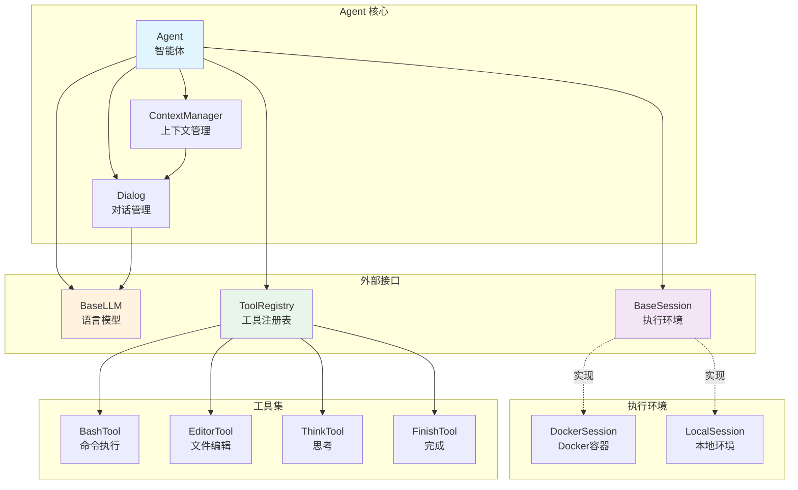
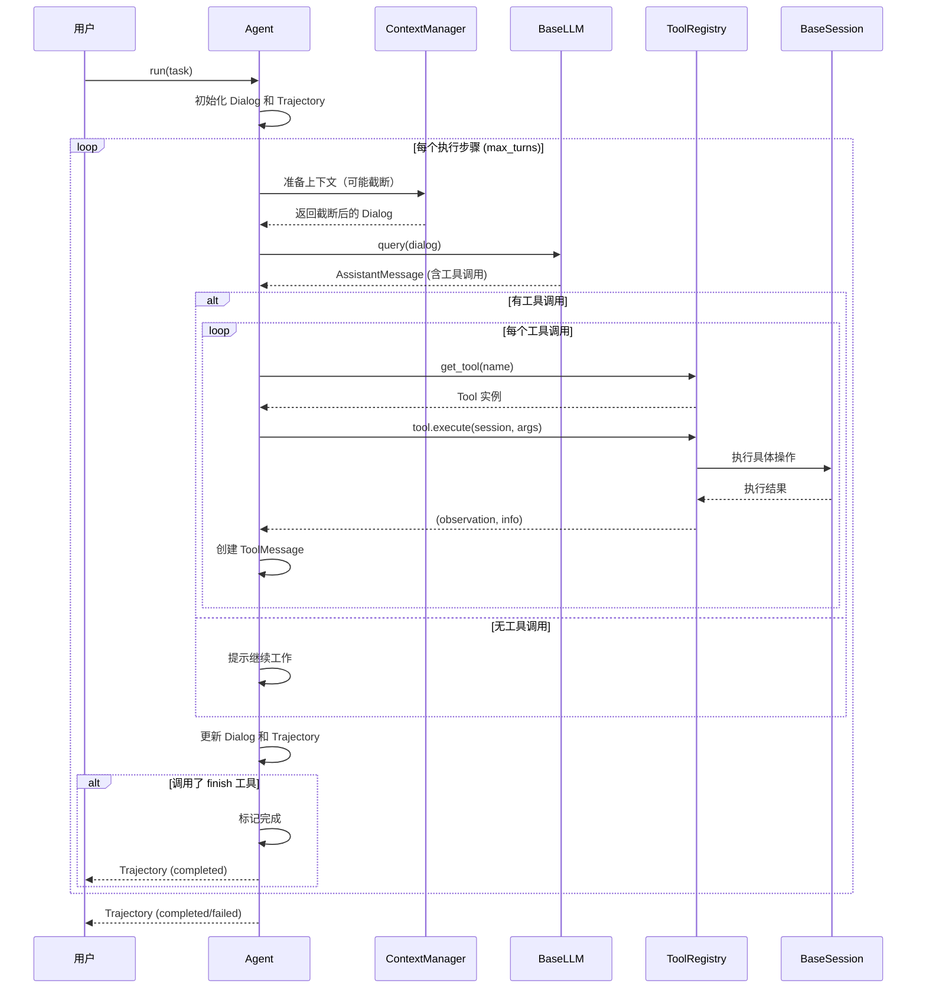
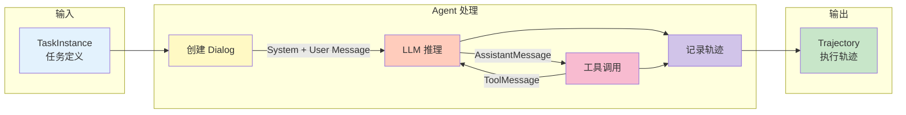

# EvoMaster Agent 模块

## 概述

Agent 模块是 EvoMaster 的智能体核心，负责任务执行、工具调用、对话管理和轨迹记录。

## 架构设计

### 文件结构

```
agent/
├── agent.py          # Agent 基类和标准实现
├── types.py          # 类型定义（Message, Dialog, Trajectory）
├── context.py        # 上下文管理（截断、压缩）
├── session/          # 环境会话（与 Env 交互）
│   ├── base.py       # Session 抽象接口
│   └── docker.py     # Docker 隔离环境实现
└── tools/            # 工具系统
    ├── base.py       # Tool 基类和注册中心
    ├── bash.py       # Bash 命令执行
    ├── editor.py     # 文件编辑工具
    ├── think.py      # 思考工具
    └── finish.py     # 任务完成信号
```

### 整体架构图



### 执行流程图



### 数据流图



## 核心组件

### 1. Agent 类

**BaseAgent**：抽象基类，定义 Agent 的核心执行流程
- 对话管理（Dialog）
- 轨迹记录（Trajectory）
- 工具调用执行
- 上下文管理

**Agent**：标准实现，可配置系统提示词
- 继承 BaseAgent
- 支持自定义 system_prompt
- 开箱即用的实现

#### 初始化参数

```python
Agent(
    llm: BaseLLM,              # LLM 实例（必需）
    session: BaseSession,      # 环境会话（必需）
    tools: ToolRegistry,       # 工具注册表（必需）
    system_prompt: str = None, # 自定义系统提示词（可选）
    config: AgentConfig = None # Agent 配置（可选）
)
```

#### AgentConfig

```python
AgentConfig(
    max_turns: int = 100,                    # 最大执行轮数
    context_config: ContextConfig = None     # 上下文管理配置
)
```

### 2. 类型系统 (types.py)

#### Message 类型
- **SystemMessage**: 系统提示词
- **UserMessage**: 用户输入
- **AssistantMessage**: 助手响应（可包含工具调用）
- **ToolMessage**: 工具执行结果

#### Dialog
对话管理器，维护消息列表和工具规格
```python
dialog = Dialog(
    messages=[...],      # 消息列表
    tools=[...]          # 工具规格列表
)
```

#### Trajectory
执行轨迹，记录 Agent 的完整执行过程
```python
trajectory = Trajectory(
    task_id: str,        # 任务 ID
    status: str,         # 状态：running/completed/failed
    dialogs: list,       # 对话列表
    steps: list,         # 步骤记录
)
```

#### TaskInstance
任务定义
```python
task = TaskInstance(
    task_id: str,            # 任务 ID
    task_type: str,          # 任务类型
    description: str,        # 任务描述
    input_data: str = "",    # 额外输入数据
)
```

### 3. Session (session/)

Session 是 Agent 与执行环境的接口，负责：
- 执行 bash 命令
- 文件操作（上传、下载）
- 环境隔离

#### BaseSession
抽象接口，定义标准方法：
- `execute_bash(command: str) -> tuple[str, int]`
- `upload_file(local_path: str, remote_path: str)`
- `download_file(remote_path: str, local_path: str)`

#### DockerSession
基于 Docker 的隔离环境实现
```python
session = DockerSession(DockerSessionConfig(
    image="python:3.11-slim",      # Docker 镜像
    working_dir="/workspace",      # 工作目录
    memory_limit="4g",             # 内存限制
    cpu_limit=2.0,                 # CPU 限制
))
```

### 4. Tools (tools/)

工具系统采用注册机制，支持动态添加工具。

#### BaseTool
所有工具的基类
```python
class MyTool(BaseTool):
    name = "my_tool"

    def execute(self, session: BaseSession, args_json: str) -> tuple[str, dict]:
        # 执行逻辑
        return observation, info
```

#### 内置工具
- **BashTool** (`execute_bash`): 执行 bash 命令
- **EditorTool** (`str_replace_editor`): 文件查看和编辑
- **ThinkTool** (`think`): 思考工具（不影响环境）
- **FinishTool** (`finish`): 任务完成信号

#### ToolRegistry
工具注册中心
```python
# 创建默认工具集
tools = create_default_registry()

# 注册自定义工具
tools.register(MyTool())

# 获取工具
tool = tools.get_tool("my_tool")
```

### 5. Context Manager (context.py)

管理对话上下文，防止超出 LLM 的 token 限制。

#### ContextConfig
```python
ContextConfig(
    max_tokens: int = 128000,                    # 最大 token 数
    truncation_strategy: str = "latest_half",    # 截断策略
    token_counter: TokenCounter = None           # Token 计数器
)
```

#### 截断策略
- **NONE**: 不截断
- **LATEST_HALF**: 保留最新的一半消息
- **SLIDING_WINDOW**: 滑动窗口
- **SUMMARY**: 摘要压缩（待实现）

## 使用方法

### 基础使用

```python
from evomaster import (
    Agent,
    create_llm,
    LLMConfig,
    DockerSession,
    DockerSessionConfig,
    create_default_registry,
    TaskInstance,
)

# 1. 创建 LLM
llm = create_llm(LLMConfig(
    provider="openai",
    model="gpt-4",
))

# 2. 创建 Session
session = DockerSession(DockerSessionConfig(
    image="python:3.11-slim",
))

# 3. 创建 Agent
agent = Agent(
    llm=llm,
    session=session,
    tools=create_default_registry(),
)

# 4. 定义任务
task = TaskInstance(
    task_id="task-001",
    task_type="coding",
    description="Write a Python function to calculate factorial",
)

# 5. 执行任务
with session:
    trajectory = agent.run(task)

# 6. 查看结果
print(f"Status: {trajectory.status}")
print(f"Steps: {len(trajectory.steps)}")
```

### 自定义系统提示词

```python
custom_prompt = """You are an expert Python programmer.
Your goal is to write clean, efficient, and well-documented code.
Always include docstrings and type hints.
"""

agent = Agent(
    llm=llm,
    session=session,
    tools=create_default_registry(),
    system_prompt=custom_prompt,  # 自定义提示词
)
```

### 自定义 Agent

如果需要更多控制，可以继承 BaseAgent：

```python
from evomaster.agent import BaseAgent, AgentConfig

class MyAgent(BaseAgent):
    def _get_system_prompt(self) -> str:
        # 自定义系统提示词逻辑
        return "My custom system prompt"

    def _get_user_prompt(self, task: TaskInstance) -> str:
        # 自定义用户提示词逻辑
        return f"Task: {task.description}"

    def _step(self) -> bool:
        # 可以覆盖单步执行逻辑
        should_finish = super()._step()
        # 添加自定义逻辑
        return should_finish
```

### 自定义工具

```python
from evomaster.agent.tools import BaseTool, BaseToolParams

# 1. 定义参数类
class MyToolParams(BaseToolParams):
    name = "my_tool"
    """My custom tool description"""

    param1: str
    param2: int = 0

# 2. 实现工具
class MyTool(BaseTool):
    name = "my_tool"
    params_class = MyToolParams

    def execute(self, session, args_json):
        params = self.parse_params(args_json)
        # 执行逻辑
        result = f"Processed {params.param1} with {params.param2}"
        return result, {"success": True}

# 3. 注册工具
tools = create_default_registry()
tools.register(MyTool())

# 4. 使用
agent = Agent(llm=llm, session=session, tools=tools)
```

## 执行流程

Agent 的执行流程如下：

```
1. 初始化 (run)
   ├── 创建 Trajectory
   ├── 创建初始 Dialog (system + user message)
   └── 设置工具规格

2. 循环执行 (_step)
   ├── 准备上下文（可能截断）
   ├── 查询 LLM
   ├── 获取 AssistantMessage
   │   ├── 如果无工具调用 → 提示继续
   │   └── 如果有工具调用 → 逐个执行
   ├── 执行工具
   │   ├── 获取工具实例
   │   ├── 调用 tool.execute(session, args)
   │   └── 生成 ToolMessage
   ├── 更新 Dialog
   ├── 记录 StepRecord
   └── 检查是否完成（finish 工具）

3. 结束
   ├── 标记状态 (completed/failed)
   └── 返回 Trajectory
```

## 配置建议

### 开发环境
```python
agent = Agent(
    llm=create_llm(LLMConfig(
        provider="openai",
        model="gpt-4-turbo",
        temperature=0.7,
    )),
    session=DockerSession(DockerSessionConfig(
        image="python:3.11-slim",
        memory_limit="2g",
    )),
    tools=create_default_registry(),
    config=AgentConfig(
        max_turns=50,  # 较少的轮数用于快速调试
    ),
)
```

### 生产环境
```python
agent = Agent(
    llm=create_llm(LLMConfig(
        provider="anthropic",
        model="claude-3-5-sonnet-20241022",
        temperature=0.5,
        max_retries=5,  # 更多重试
    )),
    session=DockerSession(DockerSessionConfig(
        image="my-custom-image:latest",
        memory_limit="8g",
        cpu_limit=4.0,
    )),
    tools=tools,
    config=AgentConfig(
        max_turns=200,
        context_config=ContextConfig(
            max_tokens=180000,
            truncation_strategy="latest_half",
        ),
    ),
)
```

## 扩展点

### 1. 自定义 Session
实现 `BaseSession` 接口以支持新的执行环境：
- 远程服务器
- Kubernetes Pod
- 本地进程
- ...

### 2. 自定义 Tool
实现 `BaseTool` 接口以添加新功能：
- 数据库查询
- API 调用
- 文件系统操作
- ...

### 3. 自定义 Context 策略
实现 `ContextManager` 的新截断策略：
- 基于重要性的保留
- 摘要压缩
- 向量检索
- ...

### 4. 自定义 Agent 逻辑
继承 `BaseAgent` 以实现特定领域的 Agent：
- 科研实验 Agent
- 代码重构 Agent
- 数据分析 Agent
- ...

## 注意事项

1. **Session 管理**: 始终使用 `with session:` 确保资源正确释放
2. **Token 限制**: 注意配置 `ContextConfig.max_tokens` 避免超出 LLM 限制
3. **工具安全**: BashTool 可执行任意命令，生产环境需要安全控制
4. **错误处理**: Agent 执行失败会抛出异常，需要适当捕获
5. **日志记录**: Agent 使用 Python logging，可通过配置查看详细日志

## 下一步开发

根据 CLAUDE.md 设计，待实现功能：
1. ✅ 基础 Agent 实现
2. ✅ LLM 接口封装
3. ✅ 配置系统
4. ⏳ MCP 调用方式
5. ⏳ Skill 系统集成
6. ⏳ 高级上下文管理（摘要压缩、长期记忆）
7. ⏳ Env 集群管理

## 参考

- **完整示例**: `examples/llm_example.py`
- **LLM 文档**: `evomaster/utils/README.md`
- **快速开始**: `QUICKSTART.md`
- **项目设计**: `CLAUDE.md`
